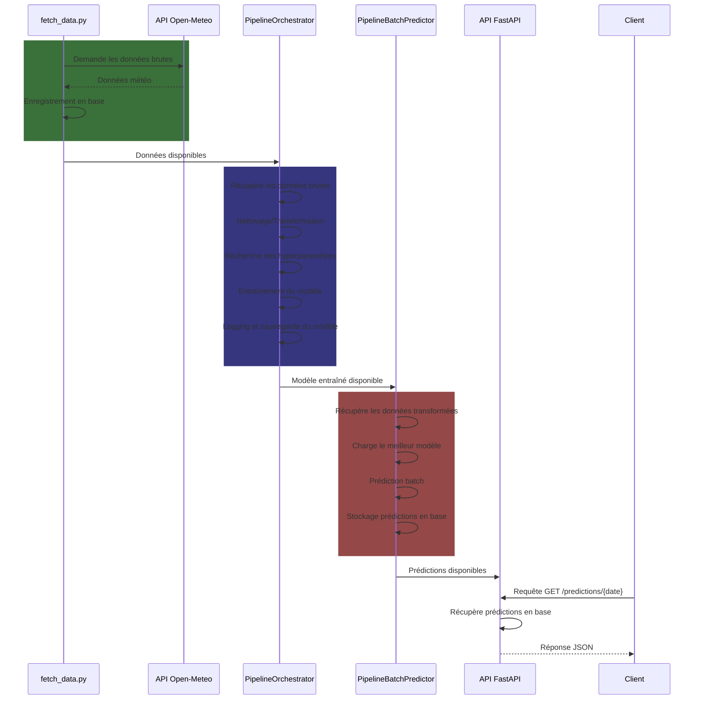
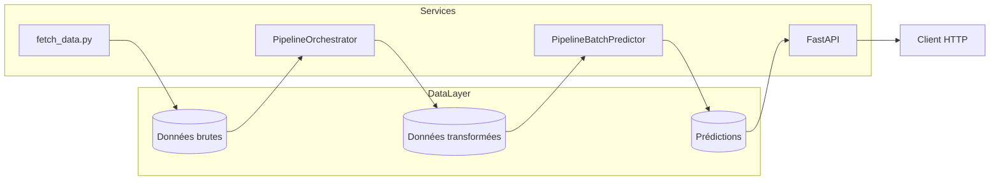

# MESP2 Laurent SINI

Système de prédiction de séries temporelles utilisant XGBoost pour prédire la température à partir de données météorologiques. Ce projet implémente un pipeline MLOps complet incluant la collecte de données, l'entraînement de modèles, l'évaluation et le déploiement via une API FastAPI.

## Architecture et Flux de Données
> **Note :** L’affichage des diagrammes Mermaid nécessite un plugin dans Visual Studio Code (ex : "Markdown Preview Mermaid Support").
> 
### Flux de Données


1. **Collecte de données** : Récupération des données météorologiques depuis l'API Open-Meteo
2. **Preprocessing** : Nettoyage et transformation des données temporelles
3. **Entraînement** : Pipeline automatisé d'optimisation des hyperparamètres et entraînement du modèle XGBoost
4. **Évaluation** : Métriques de performance et validation du modèle
5. **Déploiement** : Modèle disponible via API REST avec endpoints prédictifs

### Architecture



## Technologies Utilisées
| Composant | Technologie | Usage |
|-----------|-------------|-------|
| API Backend | FastAPI | Endpoints de prédiction |
| Modèle ML | XGBoost | Prédiction de séries temporelles |
| Base de données | PostgreSQL | Stockage des données et modèles |
| Orchestration | Docker/Docker Compose | Déploiement et environnement |
| CI/CD | GitHub Actions | Intégration continue |
| Feature Engineering | Feature Engine | Création de variables de lag |
| Monitoring | Logs & Métriques | Suivi des performances |

## Structure du Projet
```
MESP2/
├── api/                        # API FastAPI
│   ├── main.py                # Endpoints principaux
│   └── __init__.py
├── data/                       # Scripts de collecte
│   └── fetch_data.py          # Récupération données Open-Meteo
├── model/                     # Modèles et pipelines
│   ├── entity/                # Entités de base de données
│   ├── helpers/               # Fonctions utilitaires
│   ├── pipeline/              # Pipelines d'entraînement
│   ├── repository/            # Couche d'accès aux données
│   └── services/              # Services métier
├── tests/                     # Tests automatisés
│   ├── test_main.py          # Tests des endpoints API
│   └── conftest.py           # Configuration des tests
├── registry/                  # Modèles sauvegardés
├── monitoring/                # Monitoring et métriques
├── output/                    # Résultats et rapports
├── notebooks/                 # Notebooks d'exploration
├── .github/workflows/         # Pipeline CI/CD
│   └── cicd.yml              # GitHub Actions
├── Dockerfile                 # Configuration Docker
├── docker-compose.yaml        # Orchestration des services
├── requirements.txt           # Dépendances Python
└── README.md                 # Documentation
```
## Démarrage Rapide

### Prérequis
- Docker et Docker Compose
- Python 3.12

### Installation et Démarrage

1. **Cloner le repository**
   ```bash
   git clone <repository-url>
   cd <nom-du-repository>
   ```
2. Environnement Docker (Production ou Test Local)
Permet de simuler ou déployer l’environnement de production localement.
Adaptez le fichier .env selon vos besoins.
   ```bash
   cp .env.example .env
   # Éditer le fichier .env avec vos configurations
   ```
   >**Note**:
   > - APP_ENV=dev -> SQLite
   > - APP_ENV=prod -> POSTGRES

   Lancez l’application :
   ```bash
   docker-compose up -d
   ```
   > À savoir :
   > Le mode Docker est recommandé pour tester l’environnement de production localement ou pour déployer le pipeline en production (avec les bonnes informations dans le fichier .env).

3. Environnement Python Local (Développement, Optionnel)

   Pour travailler localement, il est conseillé d’utiliser un environnement virtuel Python.

   1. **Créer un environnement virtuel**
      ```bash
      python -m venv venv
      ```
   2. **Activer l’environnement**
      - **Linux/MacOS** :
        ```
        source venv/bin/activate
        ```
      - **Windows** :
        ```
        venv\Scripts\activate
        ```
   3. **Installation des dépendances (développement local)**
      ```bash
      pip install -r requirements.txt
      ```
### Orchestration du Pipeline

#### 1. Exécution complète via `start.sh`
Le script `start.sh` orchestre l'ensemble du pipeline :
```bash
./start.sh
```
Il exécute séquentiellement :
1. Collecte des données (`fetch_data.py`)
2. Entraînement du modèle (`PipelineOrchestrator`)
3. Prédictions batch (`PipelineBatchPredictor`)

> **Optimisation** : Ce script peut être planifié via `cron` pour des runs périodiques.

---

#### 2. Exécution manuelle étape par étape
Chaque composant peut aussi être exécuté indépendamment :

| Étape | Commande | Usage |
|-------|----------|-------|
| **Collecte** | `python ./data/fetch_data.py` | Récupère les données Open-Meteo |
| **Entraînement** | `python -m model.pipeline.PipelineOrchestrator` | Génère et sauvegarde un nouveau modèle |
| **Prédictions** | `python -m model.pipeline.PipelineBatchPredictor` | Calcule les prédictions pour les prochaines 24h |

> **Planification** : Le batch predictor peut être automatisé via cron :
> ```
> # Exécution toutes les 3 heures
> 0 */3 * * * /chemin/absolu/vers/PipelineBatchPredictor.sh
> ```

---

#### 3. Lancement de l'API
```bash
uvicorn api.main:app --reload --port=8000
```
> **Note** : L'API sert les prédictions pré-calculées par le batch predictor.

#### Accès à l'API

- **API Base** : `http://localhost:8000`
- **Documentation Swagger** : `http://localhost:8000/docs`
- **Adminer (BDD)** : `http://localhost:8080`

#### Endpoints Disponibles

| Endpoint | Méthode | Description |
|----------|---------|-------------|
| `/predictions/{date}` | GET | Prédictions pour une date donnée |
| `/predictions/combined/{start_date}/{end_date}` | GET | Données combinées (réelles + prédictions) |
| `/version` | GET | Version de l'API |

## Pipeline CI/CD

Le pipeline CI/CD automatise :
1. **Build** : Construction de l'image Docker
2. **Push** : Envoi vers GitHub Container Registry (ghcr.io)
3. **Tests** : Validation des endpoints

Deux workflows GitHub Actions automatisent le cycle de vie du projet:

- Sur push sur master:
  - Build, push et tag de l’image Docker avec le SHA du commit (ghcr.io/${{ github.repository }}:${{ github.sha }})
  - Tests d’intégration sur l’API et la base PostgreSQL
- Sur push d’un tag:
  - Build, push et tag de l’image Docker avec le nom du tag (ghcr.io/${{ github.repository }}:${{ github.ref_name }})
  - Utilisé pour marquer une version stable ou une release

## Tests automatisés

Des tests unitaires et d’intégration sont implémentés pour valider les endpoints de l’API.

Pour exécuter les tests localement :
```bash
pytest api/tests/
```
> **Note**: Les tests vérifient le bon fonctionnement des endpoints principaux de l’API.

**Développé dans le cadre du projet MESP2**